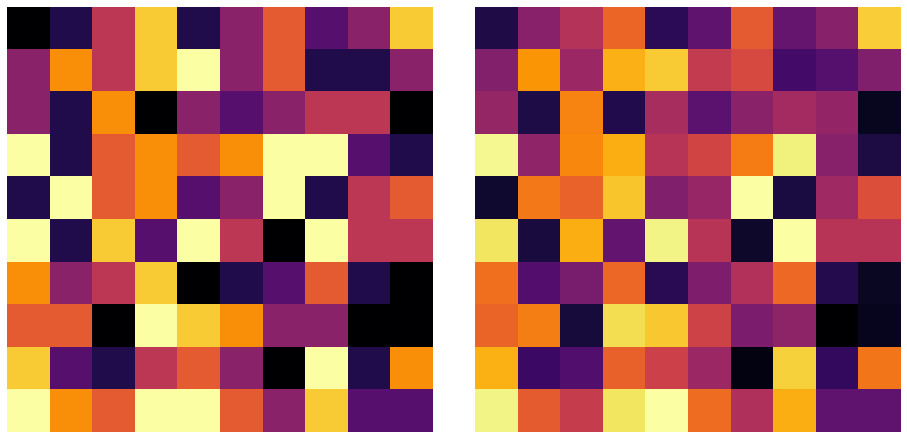
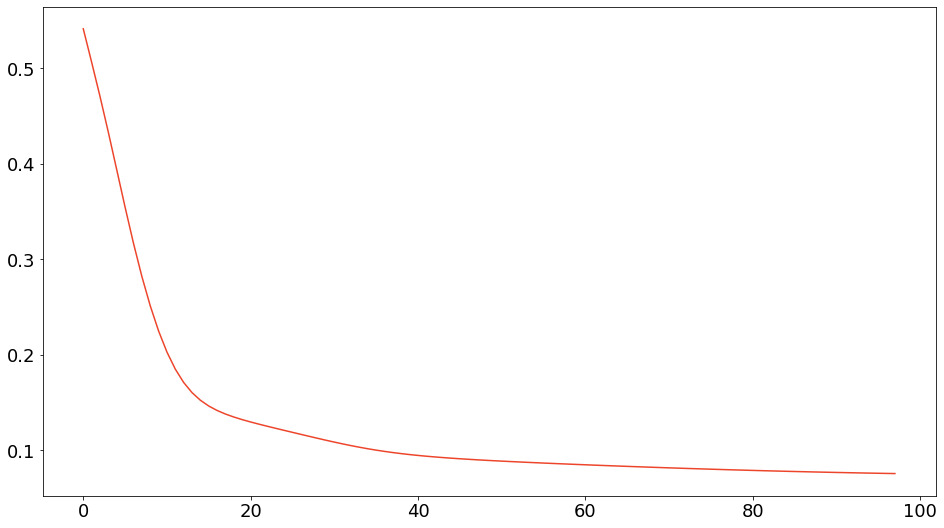

# NMF
<p align="center">
    
</p>
This directory shows the sample implementation of Euclidean-, I-divergence-, and IS-divergence-based NMF.
The implementation visualizes the result of applying NMF to an observation matrix.
You can use an arbitrary number of bases for the basis matrix.

# Requirement
- docker: 20.10.21
- docker compose: v2.13.0

# Usage
You can use the following command to run the demo.
```
git clone https://github.com/beginaid/NMF
cd MMF
docker compose up -d --build
```
All of the following options are managed by docker-compose.yml:
- L: Rows of the observation matrix
- N: Columns of the observation matrix
- M: Rows of the basis matrix
- n_ineration: Maximum number of updates
- divergence: "EU", "I", or "IS"
  - EU: Euclidean distance
  - I: I-divergence
  - IS: Itakura-Saito divergence

After the nmf container is up, a directory named "results" is created.
The directory contains a graph describing the decreasing process of the divergence and a heatmap visualizing the observation and approximation matrices (shown at the beginning of README).
<p align="center">
    
</p>

After you can see these outputs, delete the container resources using the following command.
```
docker compose down
```
Note that you can change the parameters in docker-compose.yml and run the demo as many times as you like before the resources are down.
